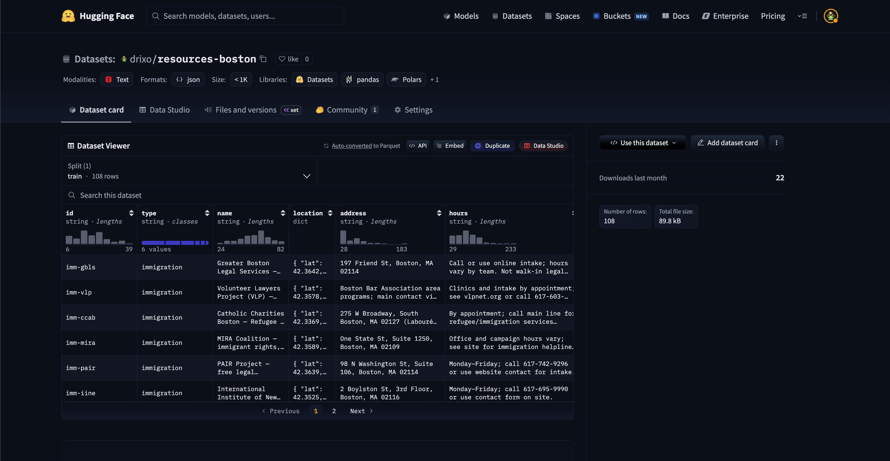
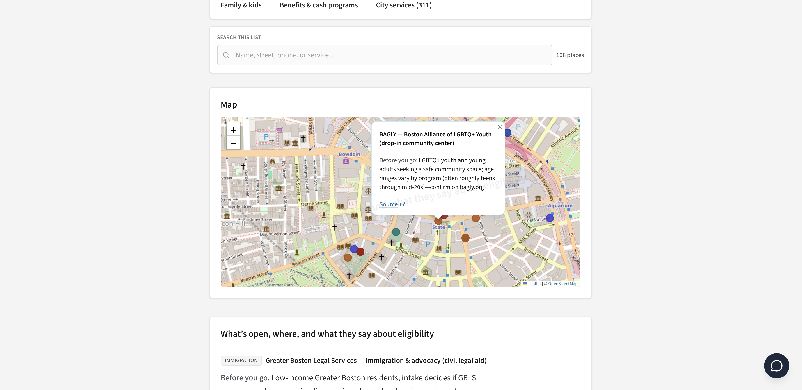
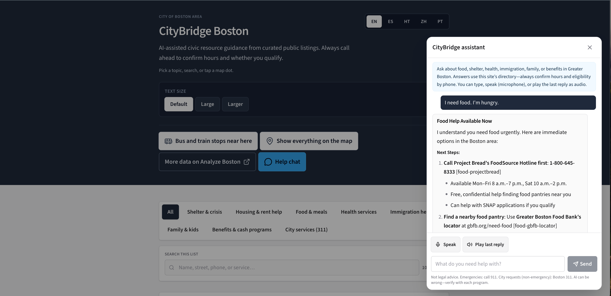
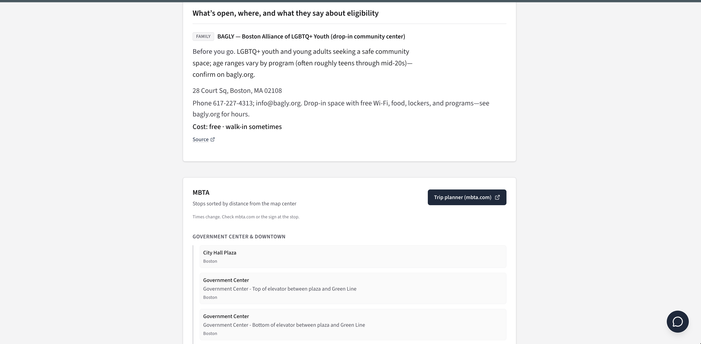

# CityBridge Boston (Boston Resource Kiosk AI)

**Project title:** CityBridge Boston — a **kiosk-style web app** for **Greater Boston civic resources** (food, shelter, health, benefits, family, immigration, city/311, and more).

**Repository folder:** `mcp-boss` **·** **Live app:** [https://city-bridge-boston.vercel.app/](https://city-bridge-boston.vercel.app/) **·** **Source:** [DannyGarciaDEV / CityBridge-Boston](https://github.com/DannyGarciaDEV/CityBridge-Boston)

The resource directory is loaded from a **Hugging Face** dataset at build time. Legal and immigration disclaimers ship in-repo in `data/resources-meta.json`.

---

## Problem statement

People under stress often need **food, shelter, health care, benefits, or legal referrals** quickly, but the information is scattered across city pages, PDFs, and many nonprofit sites. **Static long lists** are hard to use under pressure. **Generic chatbots** are risky: they can **hallucinate** phone numbers, hours, and program names.

**Who is most affected**  
Residents with limited time, data, or mobility—especially people using **kiosks or shared devices** in libraries, shelters, and community centers, where bad UX and wrong information hurt the most.

**Why it matters**  
Inaccurate or missing information wastes trips, erodes **trust** in public systems, and can steer people away from help they are eligible for.

**What success looks like**  
Someone can get **accurate, plain-language, actionable next steps** in a single session, grounded in **curated program data** (not the open web), in **multiple languages**, with an optional path to **voice** and to **transit** info for getting there. Success is visible when the **map, list, and chat** all cite the same rows from the same dataset, and when users (or evaluators) can **verify** rows against the published Hugging Face table.

---

## Solution overview

CityBridge Boston is a **kiosk-first** experience with four main ideas:

1. **Map + topics + search** — Browse a structured **directory** with **Leaflet** pins and cards, filtered by category and search.
2. **Help chat (Anthropic Claude)** — A conversational layer that is instructed to **ground** answers in a **snapshot of the same directory** the map uses, so the assistant is not a general-purpose “web oracle.”
3. **Hugging Face as the data plane** — Rows come from a versioned public dataset ([`drixo/resources-boston`](https://huggingface.co/datasets/drixo/resources-boston)) pulled at build (or on demand via **`npm run prefetch`**). You can **update the Hub** and **redeploy** to change what’s live, without a giant data diff in git.
4. **MCP server (optional, dev/agents)** — A **Model Context Protocol** service in `server/` exposes **tools** over the **same** JSON, so agents (e.g. in Cursor) can **query resources** consistently with the app.

**Role of AI**  
AI is **core to Help chat** (understanding questions, summarizing, multilingual replies, safety framing). It is **supplementary** to the **map and list**—the directory works without chat. Compared with a non-AI list alone, a grounded assistant can **interpret intent**, **synthesize steps**, and **match** user language to the right program **when that program is in the retrieval snapshot**. A key design choice is **retrieval + snapshot**: the model is only as good as the rows you send—so the app **expands** the snapshot from user **keywords** (e.g. program names) so the model can answer by name even when the program is not on the first “page” of the list.

**Chat retrieval (practical RAG without embeddings)**  
User text is **tokenized**; rows whose **name, id, address, hours, eligibility, or services** match a token are **merged into** the context sent to the model (plus the filtered list). This is lighter than embedding the whole corpus for a kiosk, but it still requires **deliberate tuning** of stopwords and snapshot size.

---

## AI integration

| Layer | Technology | Why it was chosen |
|--------|------------|-------------------|
| **Chat LLM** | **Anthropic Claude** (Messages API) | Strong **instruction-following** for **grounded**, **multilingual** answers with clear system prompts. |
| **“RAG” / retrieval** | **Keyword expansion + list filter** over `resources.json` | **Lower cost and latency** than embedding search for a mid-sized table; good **name/id** matching when users type specific programs. **Tradeoff:** not full semantic search across arbitrary phrasing. |
| **Voice (optional)** | **Deepgram** STT / TTS | Mic in the UI and “play last reply”; server strips **Markdown** before TTS. |
| **Agent surface** | **MCP** (`server/`) | **Standard tool** interface for coding agents, same data as the kiosk. |
| **Data ingestion** | **Hugging Face `datasets`** (Python) | **Reproducible** fetches; same **prefetch** in dev, CI, and Vercel build. |

**Tradeoffs** (cost, latency, reliability, accuracy)  
- **Context size** is capped: we send a **relevant slice** of rows, not the full Hub dump every time.  
- **Accuracy** depends on **dataset quality** and **retrieval**; the model is told **not to invent** programs that are not in the snapshot.  
- **No embeddings in v1:** cheaper and faster, but **synonym-heavy** questions may need future semantic search.  

**What exceeded expectations**  
Fast iteration on **MCP** contracts, **Vite** dev middleware, and **TypeScript** wiring between map, API routes, and prompts.

**What fell short / manual**  
**Retrieval edge cases** (e.g. “only first N rows in the list”) required explicit **code fixes**; **aligning** dataset fields, **snapshot**, and **system prompt** is not something models write end-to-end without human review. **AI coding tools** speed scaffolding; they do not replace **failure-mode thinking**.

---

## Architecture / design decisions

- **Monorepo**  
  - `kiosk/` — **Vite + React** UI, **Leaflet** map, **serverless-style** API routes under `kiosk/api/`.  
  - `server/` — **MCP** server (Node) for **agents**; not required to run the static+kiosk build.  
  - `scripts/` — **`fetch_resources.py`** and helpers to pull the Hugging Face dataset.  
  - `data/` — Generated **`resources.json`** (gitignored) and committed **`resources-meta.json`** (disclaimers / legal context).

- **Data flow (local dev)**  
  Browser → Vite **middleware** for `/api/boston-chat` (and related routes) → **`data/resources.json`** → **`bostonAssistant` / `bostonApiHandlers`** → Claude → JSON/Markdown to the client.

- **Data flow (production — Vercel)**  
  Browser → **Vercel serverless** `/api/*` → **snapshot** of `resources` copied at **build** next to the function → same handler logic. **Vercel** also hosts the **static** Vite build. The **MCP** server is **not** deployed on Vercel; it is for **local** or other hosts.

- **Data flow (agents)**  
  MCP client → `server/` → same **`resources.json`** (after prefetch) as the kiosk.

- **Transit**  
  **MBTA V3 API** (proxied) for **nearby stops** and **routes** near the **map center**—**separate** from the social-service directory, which still comes from **Hugging Face**.

- **Map UX**  
  The map **does not auto-pan** when the user changes **category** or **search**, so the viewer is not “yanked” away from where they were looking.

- **MCP**  
  Chosen for **interoperability** with **Cursor-style** and other **MCP clients**, not to lock the app to one vendor’s chat UI.

- **Hugging Face**  
  Chosen to **version** a civic table, track revisions on the Hub, and avoid bloating the git history with every row change.

**Production hosting (Vercel) — short version**  
- Build pulls the dataset, builds the **kiosk** bundle, and deploys **static** + **Node** API routes.  
- Use a **Node 20+** runtime; do **not** set a legacy dashboard **Install Command** that uses `pip install --user` on the system Python (this repo uses a **local venv** via `scripts/vercel-python-setup.mjs` and **`kiosk` `postinstall`**).  
- **Environment variables** in Vercel: at minimum **`ANTHROPIC_API_KEY`**, optional **`MBTA_API_KEY`**, **`DEEPGRAM_*`**, **`HF_TOKEN`** (if the dataset is private), **`ANTHROPIC_MODEL`**, etc. See `/.env.example` (placeholders only).

**API routes (Vercel / dev)**  
- `POST /api/boston-chat` — chat.  
- `POST /api/deepgram/*` — optional voice.  
- `GET /api/mbta/stops` / `GET /api/mbta/routes` — MBTA proxy.  

> **Repository layout note:** the repo can be built with Vercel **root directory** `./` or `kiosk/`; both are documented in the **detailed** deploy notes in earlier commits; root `vercel.json` and `kiosk/vercel.json` define `install`/`build`/`outputDirectory`.

---

## What did AI coding tools help you do faster—and where did they get in the way?

| Faster | Slower / manual |
|--------|-----------------|
| **Boilerplate** for MCP, Vite plugins, and TypeScript types. | **Snapshot ↔ prompt ↔ data** alignment and **hallucination** guardrails. |
| **README and script** iteration. | **Retrieval** behavior (e.g. “program not in first 55 rows”); code had to be fixed, not just prompted. |
| Prototyping **serverless** and **dev** API parity. | **Evaluating** edge cases: vague asks, missing keys, Hub rows missing, multilingual tone. |

Using **Cursor / Claude (and similar)** changed the process: more **spikes** and **refactors** in a day, but **no substitute** for testing **error paths** and **real** dataset rows.

---

## Getting started / setup

```bash
git clone https://github.com/DannyGarciaDEV/CityBridge-Boston
cd mcp-boss

python3 -m venv .venv
source .venv/bin/activate   # Windows: .venv\Scripts\activate
pip install -U pip
pip install -r requirements.txt

npm run install:kiosk
npm run install:server

# Environment: copy the example; put real keys only in .env (never commit .env)
cp .env.example .env
# Edit .env — e.g. ANTHROPIC_API_KEY (required for chat in dev), optional DEEPGRAM_*, MBTA_*, model IDs

npm run prefetch   # writes data/resources.json from Hugging Face
npm run dev:kiosk  # Vite — http://localhost:5173
```

**MCP (optional, for agent clients)**

```bash
npm run prefetch
npm run build:mcp
npm run mcp
```

**Full monorepo build (prefetch + MCP compile + kiosk)**

```bash
npm run build
```

**Check that the app is really using the Hub data**  
After `npm run prefetch`, the script prints a line like `Wrote .../data/resources.json (N resources)`. The file is **gitignored**; the map, chat, and list all read the same file in dev. To change data, **update the dataset** on Hugging Face and run **prefetch** (and redeploy for production).

---

## Demo

### Run locally (quick path)

1. Complete **Getting started** (including `prefetch` and `dev:kiosk`).  
2. **Pan/zoom** the map; pick a **category**; **search** for a program.  
3. Open **Help** and try, for example: *“Where can I get food near me?”* or a **specific program name** that exists in your JSON (e.g. *“Tell me about BAGLY”* if `fam-bagly` is in the snapshot).  
4. Optionally enable **Deepgram** in `.env` and use **mic** / **play last reply**.  
5. Scroll to **MBTA** after moving the map—**stops and routes** update from the **map center**.

**Video (optional for reviewers)**  
Add a short walkthrough (e.g. Loom) link here: `https://` *(replace with your recording).*

### Screenshots (from this build)

**1) Hugging Face — `drixo/resources-boston` (source of truth)**  
  
The public dataset in **JSON** (e.g. `id`, `type`, `name`, `location`, `address`, `hours`). CityBridge does not edit the Hub in-app; **prefetch** materializes this into `data/resources.json` for the **map, list, and chat**.

**2) Kiosk — map, topics, list**  
  
Vite + React + Leaflet: **categories**, **search**, **pins**, and **cards** from the same `resources` table. The map does not auto-fly on category/search changes (kiosk-friendly).

**3) Help chat — grounded assistant**  
  
**Claude** with **grounded** instructions. Multiple UI languages. Retrieval expands the **snapshot** from the user’s words so programs can be found **by name** even off the first screen of results.

**4) MBTA — nearby stops, modes, and routes**  
  
**Stops and lines** near the **map center** (MBTA **V3** API, proxied). **Civic program** data is still from **Hugging Face**; MBTA is for **how to get there**.

---

## Testing / error handling (recommended)

| Scenario | Behavior |
|----------|----------|
| **Vague or broad questions** | System prompt nudges toward **concrete** next steps and **311 / 911** boundaries where appropriate. |
| **No `ANTHROPIC_API_KEY` on the server** | `503` with a **clear** JSON error from `/api/boston-chat`. |
| **Malformed request body** | `400` from the chat route. |
| **Hugging Face / prefetch failed** | Non-zero exit; `npm run build` fails until the dataset is **reachable** (or **HF_TOKEN** set for private data). |
| **Program not in the Hub / snapshot** | The model is instructed **not to invent** it; update the **dataset** or help the user refine the question. |
| **Noisy tokens** | Very short tokens and a **stopword** list reduce matching half the table on words like “the.” |
| **Client render errors** | A React **error boundary** avoids a blank screen for uncaught client failures. |
| **MBTA rate limits** | **Optional** `MBTA_API_KEY` on Vercel; stops/routes are best-effort if the network or API is down. |

---

## Future improvements / stretch goals (optional)

- **Semantic / embedding search** when keyword match is not enough.  
- **Live shelter availability** when a **trusted, permitted** API exists.  
- **Offline-first** or **PWA** packaging for unstable kiosk Wi‑Fi.  
- Deeper **accessibility** (screen reader, contrast themes) for public terminals.

---

## Public application (optional)

**Production web app**  
[https://city-bridge-boston.vercel.app/](https://city-bridge-boston.vercel.app/)

Chat, voice, and high MBTA rate limits need **env vars** set in the Vercel project: see **`.env.example`** and the **Architecture** section above. **No API keys** are in this repository; use the hosting provider’s **secret** settings.

---

## Acknowledgments & third-party data

This project is **original** work, built on **open** libraries and **documented** APIs:

| Area | Third party |
|------|-------------|
| **Data** | [Hugging Face](https://huggingface.co/datasets/drixo/resources-boston) dataset; City of Boston–style and nonprofit fields as represented in the Hub revision you pull. |
| **LLM** | [Anthropic](https://www.anthropic.com/) Claude via the **Messages API** (key never committed). |
| **Voice (optional)** | [Deepgram](https://deepgram.com/) (keys via env). |
| **Transit** | [MBTA V3 API](https://www.mbta.com/developers) (public; optional `MBTA_API_KEY` for rate limits). |
| **Runtime / hosting** | [Vercel](https://vercel.com/) for the static + serverless deploy; [Node.js](https://nodejs.org/) **20+**. |
| **Maps** | [Leaflet](https://leafletjs.com/) and [OpenStreetMap](https://www.openstreetmap.org/) tiles (see in-app attributions). |
| **MCP** | [Model Context Protocol](https://modelcontextprotocol.io/) and [@modelcontextprotocol/sdk](https://github.com/modelcontextprotocol/sdk) for the `server/` tools. |
| **Python** | `datasets` / `huggingface-hub` in `requirements.txt` for the fetch script. |


**Data & legal**  
The app is **not** legal or medical advice. Users should **call ahead**; immigration language is **supplemented** by in-repo `data/resources-meta.json` where applicable.

---

## Submission & review note (Klaviyo AI Builder–style checklists)

By submitting a README and optional video, you should ensure: **no live secrets in git**; **third-party** services listed above; **original** project; **no employer confidential** or proprietary code; and content appropriate for a **hiring** context. The **full** program terms, privacy, and IP conditions are provided in the **official** application you sign—**read and follow** those documents. This section is a **convenience checklist** only, not a replacement for program terms.

---

## License / data (disclaimer)

Not legal advice. Always **confirm** hours, eligibility, and **immigration** rules with a qualified professional or the organization directly. See `data/resources-meta.json` for the **immigration**-related disclaimer text shown in the app.
